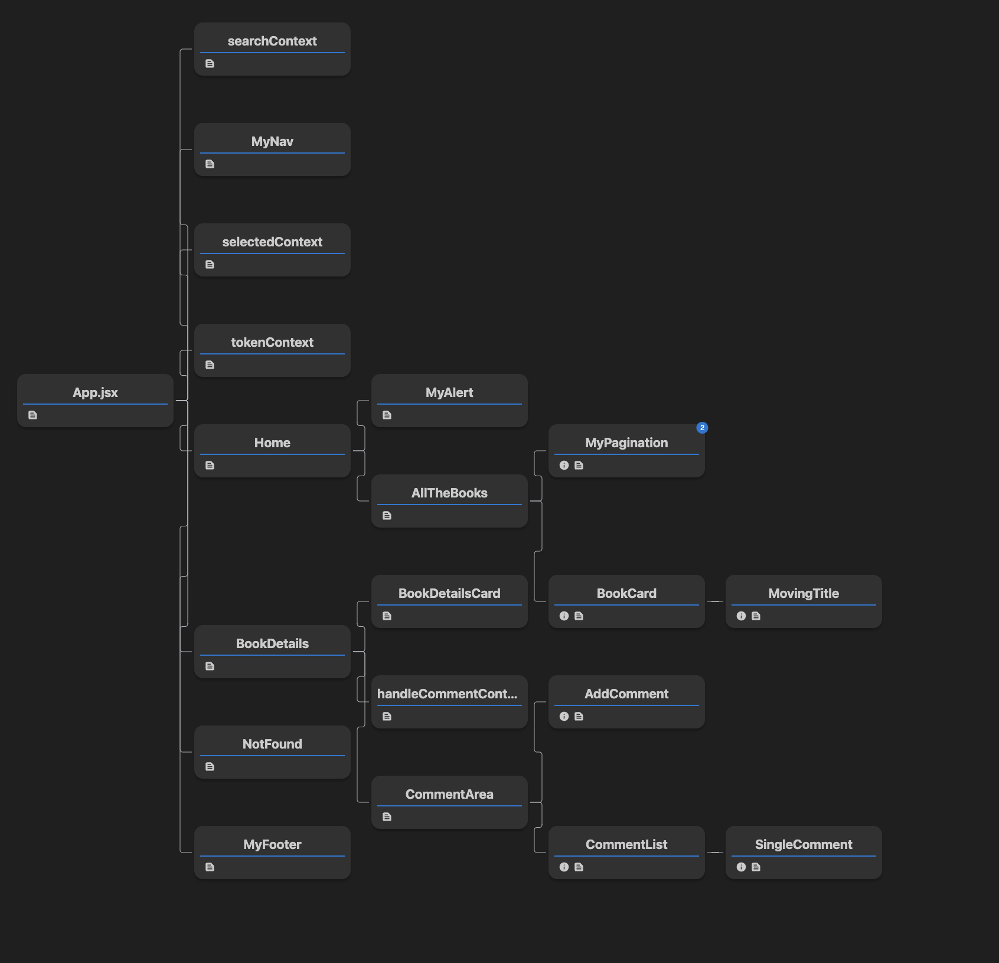

# EpiBook con React ~ _final version_

## Struttura componenti

## Test implementati
- **MyAlert** viene renderizzato correttamente 
- **AllTheBooks** renderizza massimo 21 card (scelta mia, visto che uso la paginazione)
- **BookDetails** monta correttamente CommentArea
- **CommentArea** renderizza i commenti (mock della fetch con due commenti)

